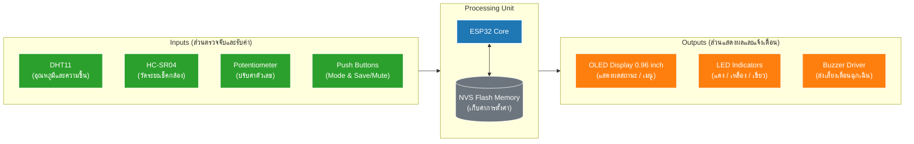

# 🛡️ ระบบเฝ้าระวังและแจ้งเตือนตู้กันชื้น (Save My Camera)

ระบบตรวจสอบตู้กันชื้นอัจฉริยะที่สร้างด้วย **ESP32** โปรเจกต์นี้ช่วยให้ตรวจสอบอุณหภูมิและความชื้นของตู้เก็บกล้อง ตรวจจับว่ามีกล้องวางอยู่ข้างในหรือไม่ด้วยเซ็นเซอร์อัลตราโซนิก และแจ้งเตือนดสถานะด้วย (ไฟ LED) (จอ OLED)และเสียง (Buzzer) เมื่อสภาพแวดล้อมเกินค่าความปลอดภัยที่ตั้งไว้

## ✨ ฟีเจอร์หลัก (Features)

- **🌡️ การตรวจสอบสภาพแวดล้อม:** ติดตามอุณหภูมิและความชื้นแบบเรียลไทม์ผ่านเซ็นเซอร์ DHT11
- **📷 การตรวจจับกล้อง:** ใช้เซ็นเซอร์ Ultrasonic เพื่อเช็คว่ากล้องถูกเก็บไว้ในตู้หรือไม่
- **🎛️ หน้าจออินเตอร์เฟซ (UI):** เลื่อนดูและตั้งค่าต่างๆ ผ่านปุ่ม (Potentiometer) และจอ OLED
- **💾 ระบบบันทึกค่าถาวร:** การตั้งค่าของผู้ใช้ (ระยะเซ็นเซอร์, ขีดจำกัดอุณหภูมิ/ความชื้น, เวลาหน่วง) จะถูกบันทึกลงในหน่วยความจำแฟลช NVS ของ ESP32 อย่างถาวร (`Preferences.h`) ปิดเครื่องหรือไฟดับค่าก็ไม่หาย!
- **🚨 ระบบแจ้งเตือนอัจฉริยะ:** 
  - ไฟแสดงสถานะ 3 สี (เขียว = ปลอดภัย, เหลือง = ขัดข้อง, แดง = แจ้งเตือน)
  - เสียงเตือนผ่าน Buzzer (พร้อมฟังก์ชันกดปุ่มเพื่อ Mute ปิดเสียงชั่วคราว)

## 📌 Block Diagram 

## 🔀 ผังงานการทำงาน (Flowchart)

## 🛠️ อุปกรณ์ที่ต้องใช้ (Hardware Requirements)

- **ไมโครคอนโทรลเลอร์:** ESP32 DOIT DevKit V1
- **หน้าจอ:** 0.96" OLED Display (SSD1306, I2C)
- **เซ็นเซอร์:** 
  - DHT11 (เซ็นเซอร์วัดอุณหภูมิและความชื้น)
  - HC-SR04 (เซ็นเซอร์วัดระยะทางอัลตราโซนิก)
- **อินพุต (Inputs):**
  - 1x โพเทนชิโอมิเตอร์ 
  - 2x ปุ่มกด (ปุ่ม Mode และปุ่ม Save)
- **เอาต์พุต (Outputs):**
  - 3x หลอด LED (แดง, เหลือง, เขียว)
  - 1x Buzzer

### 📋 รายการเอกสารทางเทคนิค (Component Datasheets)

| อุปกรณ์ (Component) | เอกสารอ้างอิง (Datasheet) |
| :--- | :--- |
| **ESP32 DOIT DevKit V1** | [ESP32 Datasheet](https://docs.espressif.com/projects/esp-dev-kits/en/latest/esp32/esp-dev-kits-en-master-esp32.pdf) |
| **0.96" OLED Display** | [SSD1306 Datasheet](https://e2e.ti.com/cfs-file/__key/communityserver-discussions-components-files/791/SSD1306-Datasheet-for-096-OLED-_2800_1_2900_.pdf) |
| **DHT11 Sensor** | [DHT11 Datasheet](https://moodle.upm.es/en-abierto/pluginfile.php/47163/mod_page/content/10/DHT11.PDF) |
| **HC-SR04 Ultrasonic** | [HC-SR04 Datasheet](https://www.alldatasheet.com/datasheet-pdf/view/1132204/ETC2/HCSR04.html) |

## 🔌 การต่อสาย (Pin Configuration)

| อุปกรณ์ (Component) | ขา ESP32 (Pin) | หมายเหตุ (Note) |
| :--- | :--- | :--- |
| **OLED SDA** | GPIO 21 | มาตรฐาน I2C |
| **OLED SCL** | GPIO 22 | มาตรฐาน I2C |
| **DHT11 Data** | GPIO 4 | |
| **HC-SR04 Trig** | GPIO 33 | |
| **HC-SR04 Echo** | GPIO 34 | |
| **Potentiometer**| GPIO 35 | พอร์ต Analog Input |
| **ปุ่ม Mode** | GPIO 18 | เปิด `INPUT_PULLUP` (ต่อขาเข้า GND) |
| **ปุ่ม Save** | GPIO 19 | เปิด `INPUT_PULLUP` (ต่อขาเข้า GND) |
| **ไฟ LED แดง** | GPIO 25 | ต่อผ่านตัวต้านทาน 330Ω |
| **ไฟ LED เหลือง** | GPIO 26 | ต่อผ่านตัวต้านทาน 330Ω |
| **ไฟ LED เขียว** | GPIO 27 | ต่อผ่านตัวต้านทาน 330 |
| **Buzzer** | GPIO 14 | |

### 📐 แผนภาพการต่อวงจร (Circuit Diagram)

## 💻 ซอฟต์แวร์และไลบรารี (Software & Libraries)

โปรเจกต์นี้พัฒนาด้วย (**PlatformIO**) อย่าลืมติดตั้งไลบรารีต่อไปนี้ก่อนทำการคอมไพล์โค้ด:

- `Adafruit GFX Library`
- `Adafruit SSD1306`
- `DHT sensor library` (โดย Adafruit)

## 📖 คู่มือและขั้นตอนการใช้งาน (How to Use & Quick Start)

### 🚀 ลำดับขั้นตอนการใช้งานระบบ (Step-by-Step)
1. **การบูตระบบ:** จ่ายไฟเข้าบอร์ด ESP32 ระบบจะอ่านค่าคอนฟิกเดิมจากหน่วยความจำ NVS Flash และเข้าสู่ **หน้าหลัก (Normal Mode)** ทันที
2. **การเฝ้าระวังปกติ:**
   - **มีกล้องในตู้:** เซ็นเซอร์ Ultrasonic ตรวจพบกล้อง ระบบจะคอยวัดความชื้น/อุณหภูมิ หากปลอดภัยไฟ LED สีเขียวจะติด
   - **หยิบกล้องออก:** จอ OLED จะแสดงสถานะ `"No Camera"` ทันที และระบบจะหยุดเสียงแจ้งเตือนเพื่อเข้าสู่โหมด Standby
3. **การเข้าเมนูตั้งค่า:** กด **ปุ่ม Mode (ซ้าย)** เพื่อเข้าสู่เมนูและวนเปลี่ยนหน้า 1 ถึง 5
4. **การปรับค่าพารามิเตอร์:** หมุน **Potentiometer (ปุ่มปรับค่า)** เพื่อเพิ่มหรือลดตัวเลขในหน้านั้นๆ
5. **การบันทึกค่า:** กด **ปุ่ม Save (ขวา)** 1 ครั้งเสมอเพื่อบันทึกลงหน่วยความจำ NVS (หากกดปุ่ม Mode ข้ามไป ระบบจะไม่จำค่าใหม่)
6. **การปิดเสียงเตือน:** หากเกิดการแจ้งเตือนฉุกเฉิน (ไฟแดงติด / บัซเซอร์ดัง) สามารถกด **ปุ่ม Save / Mute (ขวา)** ในหน้าจอหลักเพื่อปิดเสียงเตือนชั่วคราวได้

---

### 🎛️ สรุปหน้าที่ของปุ่มควบคุม (Controls Summary)
- **ปุ่มซ้าย (Mode):** ใช้กดเพื่อเข้าโหมดตั้งค่า, เปลี่ยนหน้าเมนู หรือกดข้ามไปหน้าถัดไปเมื่อไม่ต้องการแก้ไขค่า
- **ปุ่มขวา (Save / Mute):** 
  - ขณะอยู่ในหน้าจอตั้งค่า: ใช้สำหรับ **บันทึก (Save)** ค่าใหม่ลงหน่วยความจำ
  - ขณะอยู่ในหน้าจอหลักที่มีเสียงเตือน: ใช้สำหรับ **ปิดเสียงชั่วคราว (Mute)**
- **ปุ่มหมุน (Potentiometer):** ใช้หมุนปรับค่าตัวเลขพารามิเตอร์

---

### ⚙️ ลำดับหน้าจอและเมนูการตั้งค่า (Menu Navigation)
เมื่อกด **ปุ่ม Mode (ซ้าย)** หน้าจอจะวนตามลำดับดังนี้:
- **หน้าหลัก (Normal Mode):** แสดงอุณหภูมิและความชื้นแบบเรียลไทม์ พร้อมแสดงระยะเวลาที่เก็บกล้อง หากนำกล้องออกจะขึ้นสถานะว่า "No Camera"
- **หน้าที่ 1 - ตั้งระยะตรวจจับ (Set Distance):** หมุนปรับระยะความลึกของตู้ เพื่อให้เซ็นเซอร์ Ultrasonic แยกแยะระหว่างผนังตู้กับตัวกล้อง
- **หน้าที่ 2 - ตั้งอุณหภูมิสูงสุด (Set Temp Limit):** กำหนดขีดจำกัดอุณหภูมิสูงสุด (°C)
- **หน้าที่ 3 - ตั้งความชื้นต่ำสุด (Set Humi Min):** กำหนดค่าความชื้นสัมพัทธ์ขั้นต่ำ (%) ป้องกันชิ้นส่วนยางเสื่อมสภาพ
- **หน้าที่ 4 - ตั้งความชื้นสูงสุด (Set Humi Max):** กำหนดค่าความชื้นสัมพัทธ์สูงสุด (%) ป้องกันการเกิดเชื้อรา
- **หน้าที่ 5 - ตั้งเวลาหน่วง (Set Delay):** กำหนดระยะเวลา (นาที) เพื่อชะลอการแจ้งเตือน ให้ตัวดูดความชื้นปรับสภาพอากาศหลังปิดตู้

## 📑 เอกสารและคู่มือการใช้งาน (Documentation & Manual)

- 📖 [คลิกเพื่อดูคู่มือการใช้งาน (Save My Camera - Microsoft Sway)](https://sway.cloud.microsoft/RhiMDbVuny8xtQOC?ref=Link)
